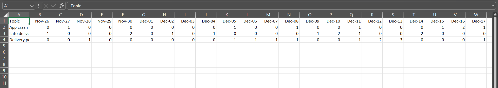

## AI Trend Analysis

This project implements a simplified **Agentic AI pipeline** to process app reviews, extract recurring topics, consolidate similar issues, and generate a **30-day rolling trend report**.  

## Features

- Extracts **topics from reviews** using predefined rules.
- Consolidates similar topics to avoid duplication.
- Generates a **30-day rolling trend table**:
  - **Rows:** Topics
  - **Columns:** Last 30 days from the latest review date
  - **Cells:** Daily frequency of each topic
- Saves output as CSV: `output/trend_report.csv`.

## Project Structure

ai_trend_analysis/
├── data/
│ └── reviews.csv # Input review data
├── extract_topics.py # Topic extraction rules
├── build_trends.py # Trend table builder
├── main.py # Full pipeline
├── output/ # Generated reports
│ └── trend_report.csv
├── README.md
└── .gitignore

---

## Installation

1. Clone the repository:

git clone https://github.com/pranee-v/ai_trend_analysis.git
cd ai_trend_analysis

3. Install dependencies:

python -m pip install pandas

--How to Run?

python main.py

---This will read reviews from data/reviews.csv

---Extract topics for each review

---Build a 30-day rolling trend table

---Save the CSV at output/trend_report.csv

## Vedio Demonstration
https://drive.google.com/file/d/13RtD2vy6Eb3VusQOJ1zR8aLLbuWrBsEc/view?usp=drive_link

## Sample Output
